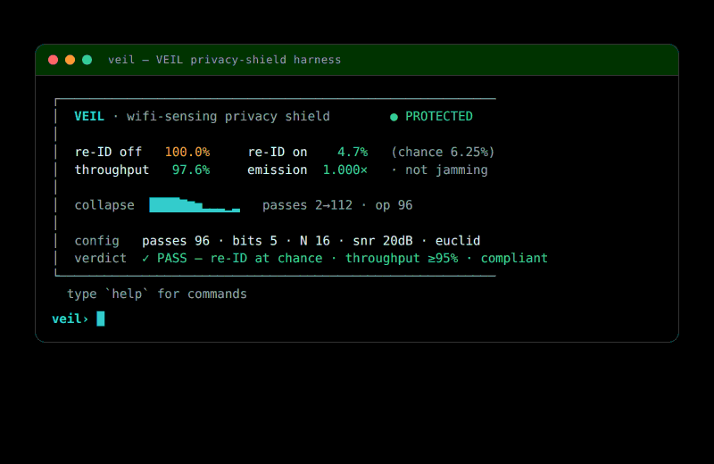

# wifi-densepose-privshield — VEIL

**VEIL** (Verifiable Emission-shaping for Identity-Leakage prevention) is the
compliant-waveform **countermeasure** counterpart to
[BFLD](../wifi-densepose-bfld) (ADR-118/121). BFLD *detects* when beamforming
feedback becomes identifying; VEIL *acts* — it shapes a node's own outgoing
beamforming feedback so that an unauthorized passive sniffer cannot
re-identify people or infer activity, while a legitimate receiver (which shares
the per-session key) sees an essentially unchanged link.

This crate is a **deterministic, dependency-free, WASM-ready reference and
experiment** — not a radio driver. It never emits RF. Every number it prints is
`SYNTHETIC`, reproduced by `cargo test -p wifi-densepose-privshield`.

See [ADR-288](../../../docs/adr/ADR-288-veil-privacy-shield-compliant-waveform.md)
and the [research bundle](../../../docs/research/privacy-shield/). A per-crate npm
contributor harness lives at
[`harness/wifi-densepose-privshield/`](../../../harness/wifi-densepose-privshield)
(ADR-289): `npx wifi-densepose-privshield-harness guidance --topic overview`.

## The idea

Identity leaks through the **fine** cross-subcarrier phase structure of a
compressed beamforming report; data throughput rides the **dominant** beam
direction. These live in (mostly) separable subspaces. VEIL composes extra
**keyed Givens rotations** — the exact primitive the report is already built
from — over the *fine* subspace only:

| Property | Consequence |
|---|---|
| **Orthogonal** (energy-preserving) | No added transmit power ⇒ **not jamming** (47 U.S.C. §333/§302a) |
| **Keyed per session** | The legitimate AP inverts it ⇒ throughput preserved |
| **Fresh each session** | A sniffer sees a different rotation every time and can't average it back ⇒ re-identification collapses to chance |

## Result (hyper-optimized default scene, N = 16 identities)

| Metric | Shield off | Shield on |
|---|---|---|
| Passive re-ID accuracy | **100%** | **4.7%** (chance = 6.25%) |
| Link throughput ratio | 100% | **97.6%** |
| Emission energy ratio | — | **1.000000** (compliant) |

The shipped shield config is not hand-picked — it is the output of the
`optimize` module (ADR-288 §opt): **96 Givens passes** (2× the proven-minimum
48 for robust collapse across both attacker metrics and N∈{16,32}; extra passes
are free because the keyed rotation is never signaled) at **5-bit** feedback
resolution (the throughput-best value in the 802.11 {5,7,9} set). The
unconstrained model optimum is 3-bit, matching the DySPAN-2026 finding.

## Threat model & scope (stated plainly)

VEIL defends against a **third-party passive sniffer** capturing plaintext
beamforming feedback. It does **not** hide identity from the AP a node is
associated with (that party holds the key by construction) — that is BFLD's
detection/policy problem, not this shield's. It is **compliant by
construction**: it only shapes the node's own standards-conformant frames, never
transmits to interfere with another station, and never operates an unauthorized
emitter. It is not jamming, not RF denial, and not a claim of camera-grade
anything.

## Run it

```bash
cargo test -p wifi-densepose-privshield --no-default-features
```

## `veil` — terminal harness & TUI

A custom, **dependency-free** native harness ships with the crate (the in-repo
counterpart to the npm metaharness). It drives the same model the tests use — an
interactive ANSI dashboard plus scriptable subcommands, std-only (no
`crossterm`/`ratatui`), so it runs in any terminal, pipe, or CI.



```bash
cargo run -p wifi-densepose-privshield --bin veil            # interactive TUI (or a one-shot report when piped)
cargo run -p wifi-densepose-privshield --bin veil -- sweep   # re-ID vs passes + throughput vs bits
cargo run -p wifi-densepose-privshield --bin veil -- optimize
cargo run -p wifi-densepose-privshield --bin veil -- doctor  # self-check, exit 0 = healthy
```

```text
┌──────────────────────────────────────────────────────────
│  VEIL · wifi-sensing privacy shield        ● PROTECTED
│
│  re-ID off   100.0%     re-ID on    4.7%   (chance 6.25%)
│  throughput   97.6%     emission  1.000×   · not jamming
│
│  collapse  ████▇▆▅▂▂▂▁▂   passes 2→112 · op 96
│
│  config   passes 96 · bits 5 · N 16 · snr 20dB · euclid
│  verdict  ✓ PASS — re-ID at chance · throughput ≥95% · compliant
└──────────────────────────────────────────────────────────
```

In the TUI, type commands to steer the shield live: `on`/`off`, `passes <n>`,
`bits <n>`, `n <k>`, `snr <db>`, `metric euclid|cosine`,
`preset scif|board|ward|hotel`, `optimize`, `proof`, `quit`. All readouts are
**SYNTHETIC / L0**.

A self-contained graphical **VEIL Console** web dashboard mirrors this same
instrument — it ships in [`ui/veil-console.html`](ui/veil-console.html) (open it
in any browser; no build, no network). `veil` is the terminal-native version.

## Modules

| Module | Purpose |
|---|---|
| `prng` | Deterministic, WASM-safe PRNG + key derivation |
| `linalg` | Givens-rotation vector algebra |
| `identity` | SYNTHETIC two-subspace beamforming-feedback model |
| `protector` | The compliant waveform controls (the shield) |
| `attacker` | Passive re-identification adversary (Euclidean + Cosine metrics) |
| `throughput` | Link-throughput model (residual + feedback-airtime + sounding) |
| `compliance` | Machine-checkable "not jamming" audit |
| `experiment` | Attacker-vs-protector head-to-head |
| `optimize` | Finds the optimal shield config (feedback bits, min passes, Pareto frontier) |
| `proof` | Byte-stable deterministic witness |
