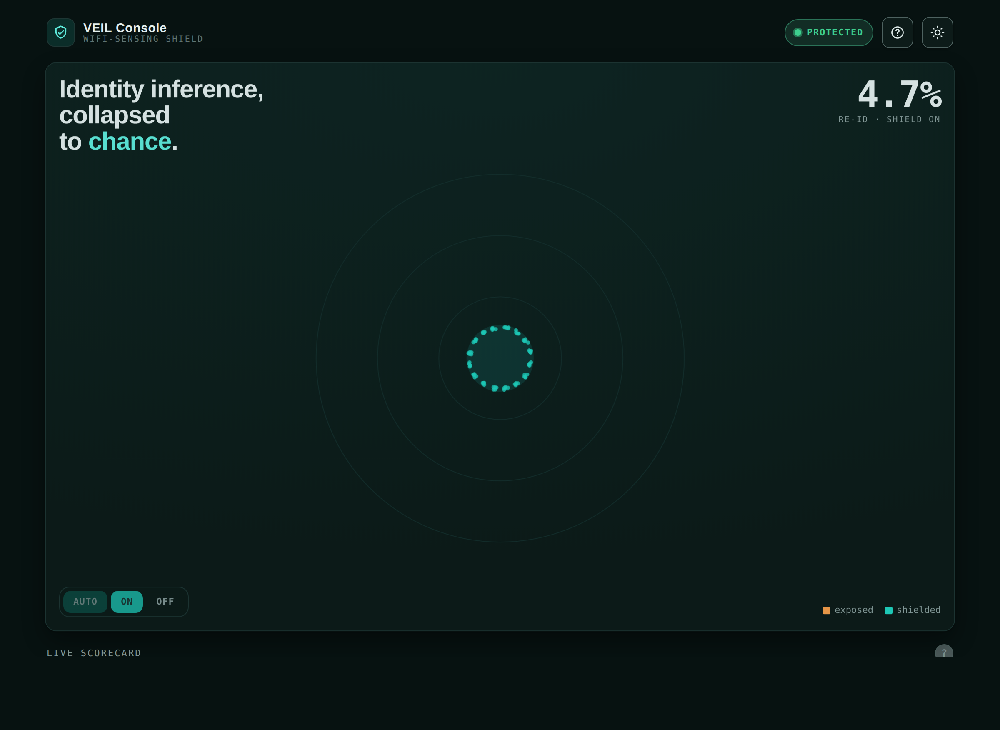

# WiFi Veil

**A privacy firewall against unauthorized WiFi sensing — compliant waveform
controls only, never jamming.**

**WiFi Veil** (codename **VEIL** — Verifiable Emission-shaping for
Identity-Leakage prevention) shapes a node's own outgoing WiFi beamforming
feedback so that an unauthorized passive sniffer cannot re-identify people or
infer activity, while a legitimate receiver — which shares a per-session key —
sees an essentially unchanged link.

> **Evidence discipline (read first).** Every defense number here is
> `SYNTHETIC` / evidence level **L0** — reproduced by `cargo test`, not measured
> on a radio. Nothing claims camera-grade accuracy, and no result becomes
> `MEASURED` without a captured hardware log (roadmap **P5**). WiFi Veil uses
> **compliant waveform controls only — never jamming.**

---

## How this protects you from unauthorized WiFi surveillance

**The threat — silent, device-free identification.** Since WiFi 5, your device
tells the router how to aim its signal by sending back *beamforming feedback* —
and it goes out **unencrypted**. Anyone within radio range can passively capture
those reports and, from the tiny stable details in them, **tell individual
people apart by their radio "fingerprint"** — through walls, with no camera, no
app, and nothing you carry. Published research re-identifies individuals, counts
occupancy through walls, and reads activity this way, and the 2025 sensing
standard (802.11bf) added the capability but **no privacy protection**. Because
the attacker only listens, you get no indication it is happening.

**The defense — scramble the fingerprint, keep the link.** WiFi Veil adds a
secret, **per-session "twist"** to your own outgoing feedback, built from the
same rotation math (Givens rotations) the report already uses:

- Your **own router shares the key** and undoes the twist instantly, so it
  decodes normally — **your WiFi keeps ~98% of its speed.**
- An **outside listener sees a *different* twist every session** and cannot
  average many captures into one stable fingerprint. Its guess of *who is in the
  room* **collapses to chance.**
- The twist only **reshapes your own, standards-legal signal** — it preserves
  the signal's energy exactly (`energy in = energy out`), so it is **compliant,
  never jamming.**

## The idea

Identity leaks through the **fine** cross-subcarrier phase structure of a
compressed beamforming report; data throughput rides the **dominant** beam
direction. These live in (mostly) separable subspaces. WiFi Veil composes extra
**keyed Givens rotations** over the *fine* subspace only:

| Property | Consequence |
|---|---|
| **Orthogonal** (energy-preserving) | No added transmit power ⇒ **not jamming** (47 U.S.C. §333/§302a) |
| **Keyed per session** | The legitimate AP inverts it ⇒ throughput preserved |
| **Fresh each session** | A sniffer sees a different rotation every time and can't average it back ⇒ re-identification collapses to chance |

## Result (hyper-optimized default scene, N = 16 identities)

| Metric | Shield off | Shield on |
|---|---|---|
| Passive re-ID accuracy | **100%** | **4.7%** (chance = 6.25%) |
| Link throughput ratio | 100% | **97.6%** |
| Emission energy ratio | — | **1.000000** (compliant) |

All figures are `SYNTHETIC / L0`, byte-reproducible via a pinned FNV-1a witness
(`cargo test`).

## Repository layout

| Path | What it is | Status |
|---|---|---|
| [`src/`](src/) + [`Cargo.toml`](Cargo.toml) | The `wifi-veil` Rust crate — deterministic, dependency-free, WASM-ready reference & experiment (attacker vs. protector, compliance audit, optimizer, proof witness) | **validated** (`cargo test`) |
| [`src/bin/veil.rs`](src/bin/veil.rs) | `veil` — the dependency-free terminal harness + ANSI TUI | validated |
| [`ui/veil-console.html`](ui/veil-console.html) | The graphical **WiFi Veil Console** — self-contained, no build, no network | — |
| [`firmware/`](firmware/) | End-to-end hardware program: a host-validated portable **C core** + honest per-provider scaffolds (openwifi / openwrt / nexmon / esp32) | C core validated; adapters `SYNTHETIC / L0` build-only |
| [`harness/`](harness/) | `wifi-veil-harness` — npm MetaHarness (read-only guidance, router, flywheel) | — |
| [`docs/adr/`](docs/adr/) | Architecture decisions (ADR-288 shield, ADR-289 harness, ADR-290 hardware program) | — |
| [`docs/research/privacy-shield/`](docs/research/privacy-shield/) | SOTA survey, threat model, countermeasure design, compliance, experiment protocol, market, roadmap | — |

## Quickstart

```bash
# 1. The reference model + proof (dependency-free; builds offline)
cargo test                       # 43 tests + the pinned witness
cargo run --bin veil             # interactive TUI (one-shot report when piped)
cargo run --bin veil -- optimize # derive the shipped shield config

# 2. The portable C shield core (host test, no radio)
cd firmware/core && make test    # energy conservation, reversibility, PRNG parity

# 3. The console UI — just open it
open ui/veil-console.html        # (or double-click; no build, no network)

# 4. The npm harness (read-only guidance needs no install)
node harness/bin/cli.js guidance --topic overview
```

The crate is **dependency-free** and **WASM-ready**:

```bash
cargo build --lib --target wasm32-unknown-unknown
```

## Does this run on real WiFi hardware?

Partially today, fully on an open PHY — see [`firmware/`](firmware/) for the
per-provider feasibility matrix. In short: **openwifi** (SDR/FPGA) is the only
platform that can host the full keyed-reversible design end-to-end; **OpenWRT**
and **Nexmon** reach partial/coarse controls (the exact angles are locked in the
WiFi MCU firmware blob on commodity parts); and **ESP32 cannot shield its own
feedback** — it helps only as a sensing detector or an external-RIS controller.
All firmware is build-only `SYNTHETIC / L0`; no adapter has run on silicon.

## Threat model & scope (stated plainly)

WiFi Veil defends against a **third-party passive sniffer** capturing plaintext
beamforming feedback. It does **not** hide identity from the AP a node is
associated with (that party holds the key by construction). It is **compliant by
construction** — it only shapes the node's own standards-conformant frames,
never transmits to interfere with another station, and never operates an
unauthorized emitter. It is not jamming, not RF denial, and not a claim of
camera-grade anything.

## License

Dual-licensed under either of [Apache License 2.0](LICENSE-APACHE) or
[MIT license](LICENSE-MIT) at your option.
